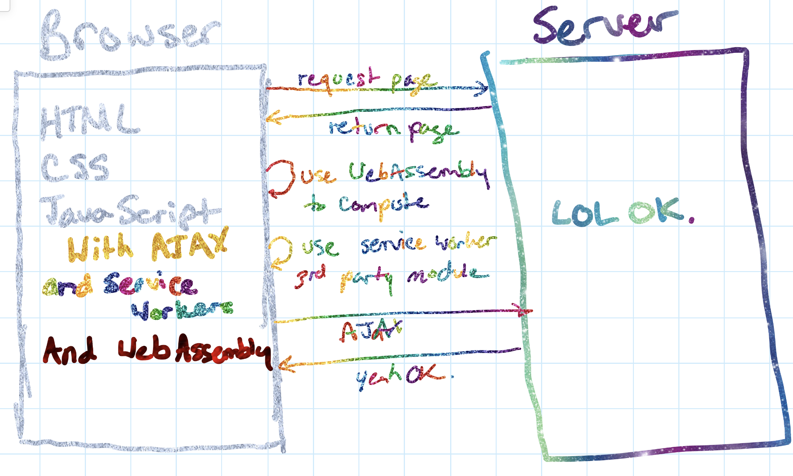

# V8, WebAssembly, and Edge Computing
## A **new way of thinking about serverless**

---

# Intro

* Kas Perch (they/their/them)
* @nodebotanist
* Developer Advocate @ Cloudflare
* Robotics addict/author

---

# What this talk is about

* A **real-world case study** at production scale.
* The subject: **building a new type of serverless offering from the ground up.**
* How we used **technologies and standards straight off the web.**
* How this all relates to **the future of serverless.**

---

# Building a **Different** Serverless Offering

* No containers
* No cold starts
* Web standards/ease of use for developers

---

# Using **V8** and **Isolates.**

* **Isolates** are a class that creates a separate instance of V8 interpreter
	* Isolates do **NOT** share memory space with each other.
	* They are, essentially, **sandboxes** for code to run in safely.

---

# Does anyone else use this model **in production?**

The video game **Screeps** uses isolates to run user code, and is a popular game running in production.

---

# But **why** use the V8 Engine?

---

# V8 is **secure.**

* $15k bug bounty.
* Transparent about vulnerabilities/issues.

---

# **Developer Experience**

* Raise your hand if you haven't written any JS, ever.
* Writing serverless functions in the same JS that developers are using all over the web.

---

# We did have to **fill in some gaps**

We ended up fully emulating the Service Worker API to represent Cloudflare Workers-- they run on a `fetch` event.

We decided to use Web standards to meet the needs of the platform in order to keep that usability.

---

# **Performance**

* V8 offers great just-in-time optimization of JS
* Couple this with the compile-optimized performance of...

---

# **WebAssembly**!

* What it is
* Why it is a **Big Deal** for the web
* Why it matters for Serverless
* How we're using it

---

# **What** WebAssembly is

* A compile target, and a programming language
* Allows you to write web code in other languages
* allows you to write in the language you want for a runtime that runs on nearly all machines
* In this case, it's all modern browsers, Node >= 8.0, and anything running on current V8 

---

# Can I Use WebAssembly today?

---

# **Why** WebAssembly is a **big deal**

* Re-use codebases that are written in other languages on the web
* Use languages that can be used to complete tasks more easily or efficiently than they can in JS
* Get compiled language performance out of V8

---

#[fit] WebAssembly Demo

---

# WebAssembly is **changing the web**.

---

---

---

---

# How we're using WebAssembly at Cloudflare

We're using a program written in Rust and compiled to WebAssembly to create Binary ASTs of user JS code on-the-fly, making it even more performant

---

# How all of this converges to create a **serverless platform**

---

# Things we care about in serverless

* Runtime
* Cold Starts
* Latency
* Developer Experience

---

# **Runtime**

Between the just-in-time optimization of V8 and the compile-time optimization of WebAssembly, you get an extremely performant runtime for Workers functions

---

# Getting rid of **Cold Starts**

* No containers to spin up, just V8 Isolates
* According to serverless-benchmark.com: ~91ms
* Internal measurement clocks in at 5ms

---

# How we get rid of Cold Starts 

---

# Decreasing **Latency**

We leveraged our existing network to run your code as physically close to your users as possible

---

# Curating an Approachable **Developer Experience**

* Use the same web technologies you've been using
* Write functions in JS, Rust, and more and more WebAssembly-compatible languages over time
* Robust web-based and CLI tooling with Wrangler
* Creating ways to deploy common web apps to serverless with ease		

---

# [fit] Demonstration: **How it all works**

---

# The future of serverless lies in **doing things in different ways.**

Creating new serverless architectures from the ground up and allowing users to try different strategies is a key part of any movement's maturity.

---

# Want to learn more?

---

# Thanks for Listening!

* kas@cloudflare.com
* @nodebotanist
* github.com/nodebotanist/serverlessdays-istanbul-2019

